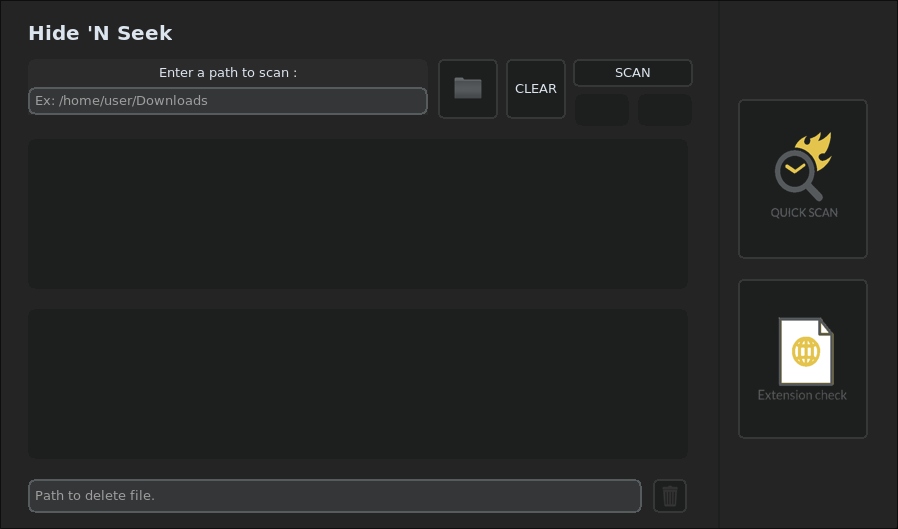

<p align = "left">
  
</p>

This **Web Scraper GUI Application** provides an intuitive and user-friendly interface for scraping web pages, extracting data, and managing scraped content. The application is built using **Python**, with a focus on modularity and efficiency, utilizing libraries such as **BeautifulSoup**, **requests**, and **customtkinter**.

### Features

- YARA Signature Scanning: Scans files using custom-built YARA rules created by analyzing real malware samples (from sources like GitHub and MalwareBazaar).

- File Extension Mismatch Detection: Identifies files that have been renamed to hide their true type by comparing file headers (magic numbers) to their extensions. YARA rules are generated dynamically for this.

- UPX Packed Malware Detection: Detects files packed with UPX, decompresses them, and rescans to reveal hidden malicious code.

- Detection via Regex: Some malware (e.g., droppers) can’t be caught reliably with YARA alone. For these cases, the app scans files for suspicious structures (like public IPs and command patterns) using regular expressions and logic-based conditions.

- Organized Codebase: Clear folder structure with separate modules for scanning, rule generation, and analysis. Easy to read and extend.


## Installation

- Clone this repository:
    ```bash
    git clone https://github.com/Zaque-69/Hide-N-Seek.git
    cd Hide-N-Seek-Main
    ```
- Install the required Python dependencies:
    ```bash
    pip install -r requirements.txt
    ```

## Usage

- Run the application:
    ```bash
    python main.py
    ```

## GUI 

<p align = "left">
  
</p>

## License

This project is licensed under the MIT License. See the LICENSE file for details.
